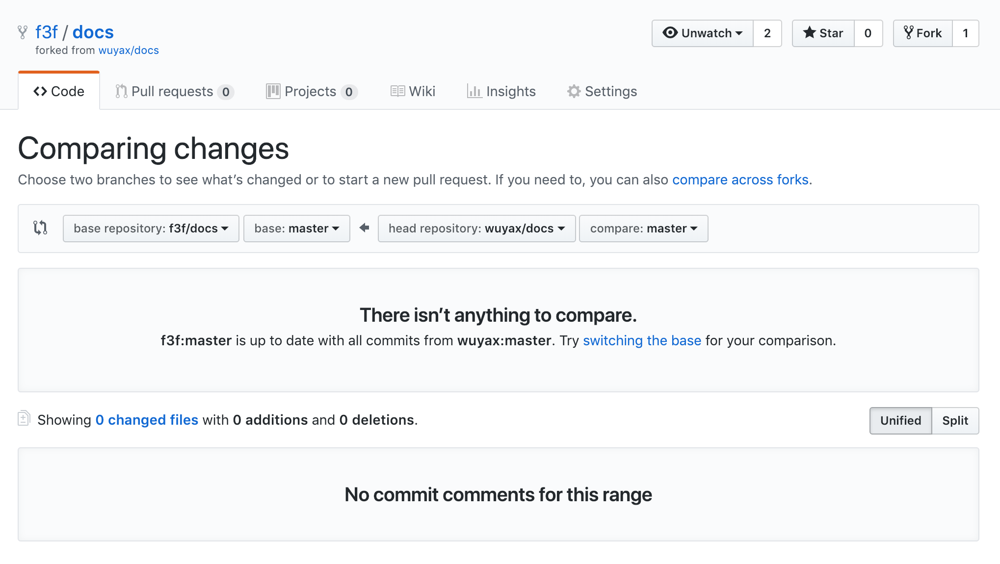

# 关于本文档

本仓库是`dtc`组件库的使用文档，[dtc](https://github.com/f3f/DTC)托管在GitHub上，同时你可以`npm`或者`CDN`的方式使用`dtc`，关于它的使用方法，请访问[dtc文档](https://f3f.github.io/docs/)。

本仓库中：

`master` 分支存放的是文档库的源码

`gh-pages` 分支存放的是静态页面

## 保持同步

所有从本仓库`fork`的代码，想要与源仓库保持同步，请使用 `Pull requests` 功能，具体操作步骤如下：

1. 点击 `Pull requests` > `New pull requests` 创建一个新的 `Pr`;
2. 在 Comparing changes 页面 `base repository` 选择 当前仓库 `head repository` 选择源仓库， 分支都选择 `master` 分支;

  

3. 比较分支，确认内容;
4. 提交 `Pr` 合并分支。
